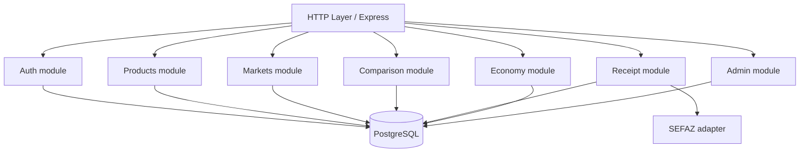

# Arquitetura de containers

## Decisão

Manter **monorepo + monólito modular**, sem microservices no MVP.

```text
ProjetoIntegradorSenac/
├── econoway_app/       # Android Flutter
├── web_frontend/       # site + portal B2B/admin
├── node_backend/       # API modular
└── docs/               # conhecimento canônico/Obsidian
```

## Backend alvo



## Regras arquiteturais

1. Controller não deve conter SQL.
2. SQL fica em repository/service de dados.
3. Validação de entrada ocorre antes da regra de negócio.
4. Integrações externas ficam isoladas em adapters/services.
5. Rotas privadas usam autenticação e autorização explícitas.
6. Nenhum segredo possui fallback conhecido no código.
