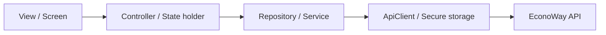

# Arquitetura Android / Flutter

## Plataforma

Android é a plataforma de entrega do Alpha/MVP. O código continua Flutter para preservar a possibilidade de iOS futura sem manter duas bases agora.

## Direção arquitetural

A referência é separação explícita entre apresentação e dados, com domínio apenas quando houver regra que justifique a camada:



A organização alvo continua **feature-first**:

```text
lib/
├── core/
│   ├── config/
│   ├── network/
│   ├── routing/
│   └── storage/
└── features/
    ├── auth/
    ├── products/
    ├── cart/
    ├── comparison/
    ├── markets/
    ├── profile/
    └── receipts/
```

Não será criada uma Clean Architecture cerimonial com interfaces sem necessidade. A fronteira deve existir porque reduz acoplamento e melhora teste, não porque o diagrama exige.

## Estado da refatoração

Executado:

- `AppConfig` centraliza `API_BASE_URL` e impede HTTP em build de produto;
- `ApiClient` centraliza HTTP e autenticação;
- JWT saiu de `SharedPreferences` e usa secure storage do dispositivo;
- logs de token foram removidos;
- DTOs de produto/comparação foram alinhados ao contrato canônico;
- duplicações antigas de autenticação/repository foram removidas;
- release Android bloqueia cleartext; debug mantém exceção local;
- package Android passou a `app.econoway.mobile`;
- carrinho possui API persistente no backend e é restaurado ao abrir o fluxo autenticado;
- seleção multi-mercado/favoritos e histórico de comparação estão ligados ao backend;
- perfil suporta edição, exportação técnica dos dados e exclusão de conta;
- scanner NFC-e usa recompensa retornada pelo servidor em vez de pontuação hardcoded;
- telas/ações sem implementação real foram removidas ou deixadas fora da navegação.

Dívida técnica conhecida:

- estado local do carrinho ainda usa `ChangeNotifier` singleton como ponte do Alpha;
- `HomeScreen` ainda é grande e deve ser decomposta em widgets/features após termos Flutter SDK disponível para regressão;
- navegação ainda é majoritariamente imperativa (`Navigator`) e pode migrar para roteamento declarativo quando o fluxo estabilizar;
- geolocalização real do Android ainda não foi introduzida; distância usa coordenadas de perfil quando disponíveis;
- `pubspec.lock` precisa ser regenerado pelo Flutter SDK;
- faltam widget/integration tests dos principais fluxos.

## Gate antes de Beta

- `flutter analyze` verde;
- `flutter test` verde;
- teste em dispositivo Android real;
- armazenamento seguro confirmado no dispositivo;
- fluxo login -> busca -> carrinho -> mercados -> comparação -> salvar -> histórico executado sem mocks;
- comportamento offline/timeout definido para telas críticas.
