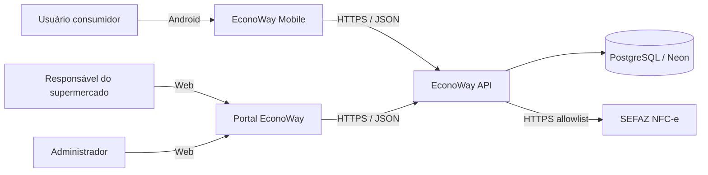

# Contexto do sistema

## Fronteiras

- Mobile e Web **não acessam PostgreSQL diretamente**.
- O backend é a autoridade sobre autenticação, autorização, regras de negócio e integridade.
- SEFAZ é integração externa e deve ser tratada como dependência não controlada.
- Preços podem vir de fontes diferentes, mas devem convergir para `oferta_supermercado` com origem e timestamp.

## Fontes de preço previstas

- `NFCE`: contribuição validada a partir de nota fiscal;
- `MANUAL`: responsável do supermercado;
- `IMPORTACAO`: lote CSV/JSON;
- `API_PARCEIRO`: futura integração oficial.
