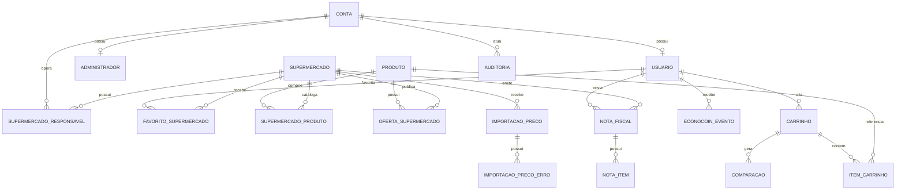

# Schema alvo PostgreSQL

> [!danger]
> Estas migrations são adequadas para **novo ambiente Alpha**. Não execute no Neon existente até obter `schema-current.sql` e produzir uma reconciliação incremental segura.

## Migrations

1. `001_core_schema.sql` - contas/perfis, mercados, produtos/ofertas, favoritos, carrinho e comparação.
2. `002_contributions_and_operations.sql` - notas, itens, ledger EconoCoins, importação e auditoria.
3. `003_alpha_integrity.sql` - integridade adicional e unicidade de carrinho aberto.
4. `004_alpha_query_indexes.sql` - `pg_trgm` e índices de busca/consulta do Alpha.
5. `005_market_catalog_membership.sql` - relação explícita de assortimento por supermercado e backfill das ofertas existentes.

O runner registra migration + SHA-256, usa advisory lock e transação para impedir execução concorrente/divergente.

## Modelo resumido

## Decisões

### Preço

Preço não pertence ao produto. A fonte de verdade é `oferta_supermercado(produto, supermercado)` com preço normal, fidelidade, fonte e data de atualização.

### Conta/perfil

`conta` contém identidade/autenticação. `usuario` guarda dados do consumidor. Operadores B2B usam `supermercado_responsavel`, permitindo N:N entre conta e unidades.

### Carrinho/histórico

Há no máximo um carrinho `ABERTO` por usuário no alvo. Ao salvar comparação, o snapshot preserva a cesta e o contexto do cálculo.

### EconoCoins

`econocoin_evento` é ledger; saldo é derivado e evento de contribuição referencia a NFC-e inédita.

### Importação

CSV/JSON, checksum, status, contadores e erros. Publicação de lote é transacional e set-based.

### Busca/performance

`004` habilita `pg_trgm` e índices adequados às buscas `%termo%` do Alpha. Em banco real, todos os índices deverão ser confirmados por volume e `EXPLAIN (ANALYZE, BUFFERS)` antes de assumir ganho.

## Catálogo por supermercado

A migration `005_market_catalog_membership.sql` cria `supermercado_produto`, separando **assortimento** de **oferta/preço**. Essa distinção evita considerar todo produto global não vendido por uma unidade como "sem preço". Importação, atualização manual e NFC-e garantem o vínculo ao catálogo antes de publicar oferta.
