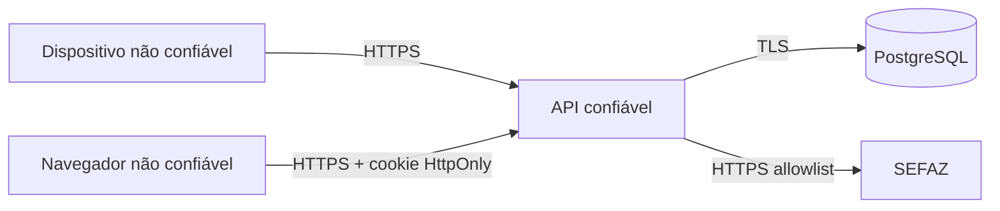

# Threat model inicial

## Ativos

- credenciais e sessões;
- contas e papéis;
- hábitos/listas de compra;
- NFC-e e dados derivados;
- localização/favoritos;
- catálogo e preços;
- vínculos de supermercados;
- histórico administrativo.

## Principais ameaças

| Ameaça | Impacto | Controle atual | Pendente |
|---|---|---|---|
| Interceptação HTTP mobile | crítico | release sem cleartext | HTTPS real do backend |
| JWT forjado por segredo default | crítico | fallback removido | secret manager/rotação |
| SSRF por QR Code | crítico | allowlist + DNS/IP + redirect validation | testes integração/egress |
| Escalada de papel | crítico | middleware RBAC | vínculo por supermercado + testes |
| Enumeração de usuários | alto | mensagem genérica | rate limit |
| Exposição de token em log/storage | alto | secure storage + logs removidos | revisão de telemetria |
| Importação maliciosa | alto | schema alvo + formato limitado | parser seguro, limites e preview |
| NFC-e duplicada/fraude de pontos | alto | ledger e unique planejados | integrar persistência ao scan |
| Query abusiva/DoS | alto | limites básicos em comparação | rate limit e observabilidade |
| Alteração indevida de preços | alto | role planejada | auditoria, vínculo e aprovação |

## Trust boundaries

Nunca confiar em validação realizada somente pelo app/browser.
